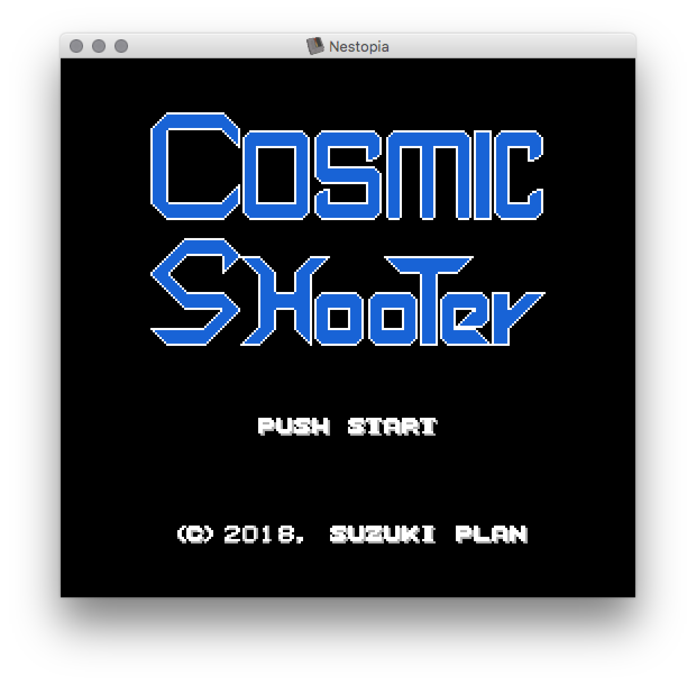
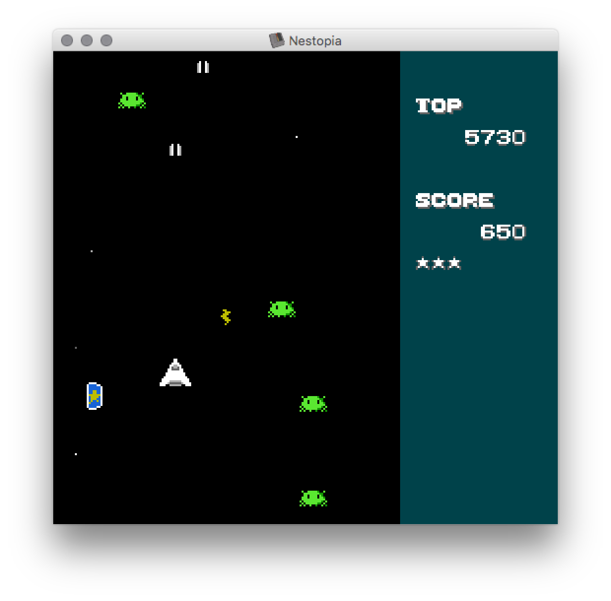

# Cosmic Shooter

NESのプログラミングを勉強するためシンプルなSTGを作ってみる。

|タイトル|ゲーム画面|
|:---:|:---:|:---:|
|||

## How to play

- [stg.nes](stg.nes)をダウンロードしてエミュレータでプレイしてください
- ファミコン標準（Mapper0）の機能しか使っていないので恐らく実機でも動きます

### Story

地球がエイリアンの植民地になってから四半世紀が経った20xx年、人類は秘密裏に開発した対エイリアン駆逐船で最後の戦闘に臨もうとしていた。エイリアンは無限に増殖してくるのでこの戦いに勝利は存在しない。エイリアンに個の感情らしきものは存在しない。統率された意識の元で、ただ破壊と資源の略奪をおこなっている。彼等の目的は一体何なのだろうか。そして、人類に未来はあるのか。約束された敗北への最後の戦いが今始まる。

### Rules

- カーソルで自機を上下左右に移動してAボタンでショットを撃てます
- ショットで敵機を破壊してください
- 敵機を破壊するとボーナスアイテムが出てきます
- ボーナスアイテムを取得すると獲得得点が上がり、落とすと獲得得点が落ちます（0以下にはなりません）
- 自機が敵機か敵ショットに衝突するとゲームオーバーです

## How to build

### Pre-requests

以下のツールが必要です。

- GNU make
- [cc65](https://cc65.github.io/)
- [bmp2chr](https://github.com/suzukiplan/bmp2chr)
- ファミコンエミュレータ

### Build command

```
make
```

## TIPS

### ポエム

私が最初にプログラミングを覚えたのは、16bit機のPC-9801のN88日本語BASIC（以下、BASIC）でした。
当時、電波新聞社のマイコンBASICマガジン（ベーマガ）に掲載されているゲームプログラムを打ち込んで遊び、言語仕様を理解したら自分でゲームを作って遊んでました。BASICはシンプルなので、ベーマガの誌面を見ながらプログラムを打ち込んでいくだけでプログラミングのやり方を理解できます。
しかし、ベーマガの誌面には時々、理解不能な数値の羅列（ダンプリスト）だけ掲載しているオールマシン語のゲームが掲載されていて、それはBASICでは到底実現不可能なレベルの動きを実現していました。

マシン語を理解してゲームを作れることは、BASIC全盛のあの頃であれば大きなアドバンテージでした。
現在では単なる過去の遺物でしかないかもしれません。
ただし、Swift、Kotlin、Phytonといった最新の高級言語であっても最終的にはマシン語に変換されてコンピュータ上で動きます。
なので、高級言語でプログラミングする場合であっても、マシン語を全く理解せずに組むよりもマシン語を理解した上で組んだ方が良いかもしれません。
つまり、実用面では使い所がないものの知識としては必要なことかもしれません。

私は中学生の頃、PC-9801のTurbo Assemblerでマシン語プログラミングの基礎を身につけたのですが、実際のところかなり苦労しました。マシン語を身につければ魔法が掛かったようなすごいゲームが簡単に作れるという幻想を抱いていたのですが、全然そんなことはありません。むしろ、拡張メモリなどが使えて処理性能も良いPC-98であれば、C言語で作ってもオールマシン語とそんなに遜色がないレベルのプログラムを作ることができます。
当時は知る由もなかったのですが、16bitのマシン語は結構難しいので、当時の私の環境がPC-98（16bit）ではなくPC-88（8bit）ならもっと簡単にマスターできた筈です。
現代のプログラマが自分のPC（恐らく64bit CPU）でマシン語を勉強すると、異次元のレベルで（16bitよりも遥かに）難しいと思われます。

マシン語を勉強するには8bit CPUで動くプログラムを書くことが一番楽なので、最も普及した8bitコンピュータではないかと考えられる任天堂のファミリーコンピュータを題材として、マシン語ゲームプログラミングの解説をしようと思い、このリポジトリを公開してみることにしました。

以下、ファミコンゲームプログラミングの技術情報を書いていきますが、ファミコンの場合、既に解析し尽くされていて、基礎的な技術情報であればWeb上に溢れているので、各々ググって調べれば良いかと思います。ここでは、（私が調べた限り）Webでは得られなかったもっと実戦寄りの知見を書いていこうと思います。

### 加算命令（ADDではなくADC）

6502の加算命令はADDではなくADC（ADD WITH CARRY）である点を注意する必用がある。

例えば, 

```assembler
    ADC #$10
```

の演算結果は `A = A + #$10(16)` ではなく `A = A + #$10(16) + C` である。

キャリー `C` は, 直前の演算結果でキャリーが立った場合は `1` で立たなかった場合は `0` になる。

```assembler
    LDX #$FF
    INX
    ; この場合, C は 1 になる
```

```assembler
    LDX #$00
    INX
    ; この場合, C は 0 になる
```

キャリーの結果に関係なく単純に加算したい場合 `CLC` 命令 (Clear Carry) を実行して予めキャリーをリセットしなければならない。（そして、6502にはキャリーを使わずに加算する命令は無い）

```assembler
    ADC #$10 ; この場合 a には 16 or 17 が加算される
    CLC
    ADC #$10 ; この場合 a には 16 が加算される
```

> 当初、ADCが単純な加算と勘違いして、計算結果が期待値と違うバグが多発して苦労させられた。（[このcommit](https://github.com/suzukiplan/stg-for-nes/commit/c6750eacc10574ab230a7290cef34441d4fdeef7) でADCの前にCLCを実行する修正を入れいているのはその為である...）

### TAXとTXAを間違えない覚え方

TAX と TXA を単純に「タックス（※税金ではない）」「タクサ」みたいな読みで最初覚えていたのだが、この覚え方には問題がある。

これらの命令はAレジスタとXレジスタの代入命令なのだが、どっち方向なのかを混同しがちである。（何処とは言わないが、逆で解説しているウェブサイトがあったりしたので余計に混乱してしまった^^;）

以下のように覚えると間違えなくなったので良い感じである。

```
TAX; Transfer A to X (AをXに代入)
TXA; Transfer X to A (XをAに代入)
```

> `from` ではなく `to` であると覚えればまず間違えない。
> ニーモニックも `A2X` や `X2A` なら間違えなかった訳だが、ニーモニックをアルファベット縛りにしているのって何か理由があるのだろうか?

### 複数オブジェクトの構造体は4byteが望ましい

自機のショット、敵機、敵弾などの複数登場するオブジェクトは 4byteの構造体 で定義するのが望ましい。4byteにすることで __同じインデックス・レジスタ(X/Y)を使ってスプライトDMAにもアクセスできる__ ので処理効率が良くなる。

高性能なCPUを使ったプログラミングに慣れていると「たった4byteとか何もできないじゃん」と思われるかもしれないが、8bitのCPUならそれで割と何とかなる。

具体的には, 全ての構造体は以下のようなデータ構成になるのではないかと思われる。

- 生存フラグ（兼種別判定）で1byte
- 座標で2byte
- 汎用変数で1byte

### サブルーチンの使い所

サブルーチンの呼び出しによる処理分岐は、ロジックを構造化して見やすくできる反面メチャクチャ重い。
具体的にはJSR(呼び出し)で6サイクル、RTS(復帰)で6サイクルなので合計12サイクルも使ってしまう。

ファミコンのCPU (RP2A03) の性能は1.7MHzなので、1秒に約170万サイクル実行できる。
1フレーム（1/60秒）では約28333サイクル実行できる。
この中でメインループの全ての処理を実行しなければならないので、たった12サイクルされど12サイクルである。

なので、サブルーチン呼び出しで処理を構造化しようとするとイタイ目を見る。
もちろん、実装をキレイに構造化しないと後から手を入れるのが困難なスパゲッティプログラムになってしまうので、それはそれで困りモノであるが。処理速度的に問題ない内はキレイに構造化しておき、性能が足りなくなったら構造化を崩しながら最適化に努めるという手も無くはない。

なお、そんな「なるべく使わない方が良いサブルーチン」だが、ブランチ命令は最大でも255バイト先までしかジャンプできないので、その問題に引っかかる場合には使わざるを得ない。インデックスを複数回す２重ループとかを実装すると、外側のループがブランチで飛べなくなるので内側のループ処理をサブルーチン化する必用が出てくる。[stg.asm](stg.asm)では、敵キャラと自機ショットの当たり判定をするため、敵キャラの移動ループ内で自機ショットとの当たり判定処理（sub_moveEnemy_hitCheck）をサブルーチンとして呼び出すようにしている。

> 余談だが、6502にはindexレジスタがxとyの２つあるが、ゲームを作る上では2つのindexがあることがかなり便利だと当たり判定のロジックを組んでみて実感できた。

### 性能限界との付き合い方

このサンプルゲームの場合, 自機と敵ショットの当たり判定を入れた [このcommit](https://github.com/suzukiplan/stg-for-nes/commit/5e0a6c376607ee9166ea8eac3521c52a657a8ef6) でついにファミコンの性能限界を超えて処理落ちが発生するようになった。そこで、以下2点の修正を入れて何とか限界回避することにした。

- 敵ショットの上限数を16→8に下方修正 ([commit](https://github.com/suzukiplan/stg-for-nes/commit/d9af0c70d0d22e6c33ae81e8ad64bbc77b284cdd))
- 変数を全部ゼロページに移す ([commit](https://github.com/suzukiplan/stg-for-nes/commit/674129675178007bb47db20e1a9249801315b95a))

幸い、ゲームの仕様上敵ショットを半減させても鬼畜難度を保てるので、敵ショットを半減させた。16じゃなくて10とかで良いかもしれないが、オブジェクト数を原則2のn乗にしたかったので8にした（※コレについては別トピックで後述するが実用的な理由は特に無い) 。

変数についても、全部の変数の総サイズを計算してみたところ余裕をもって全部ゼロページに収まるので、全部ゼロページに移した。（ゼロページに移すことでload/storeに要するサイクルを1サイクル削ることができる）

> ゼロページはWRAMの $0000〜$00FF の範囲で、この範囲内なら他（$0100〜$1FFF）と比べてフェッチ数を1削ってアクセスできるのでアクセス性能が良い反面、最大256バイトしか使えないので無闇に使うことができない。（全変数のサイズ合計が256バイト以下であれば無闇に使っても良い）

### オブジェクト数は2のn乗にすべきか？

このゲームでは、自機ショット、敵ショット、敵機などの複数オブジェクトの上限数を全て2のn乗にしているが、これには実のところ実用的な理由はない。

例えば2のn乗ではない場合、レジスタに余裕があれば以下のようにindexを使って回すことができ、この時はそもそも2のn乗にする必要はない。

```
    ldx #$05 ; x = 5
loop:
    (loop procedure)
    dex      ; x--
    bne loop ; branch if x != 0
```

ただし、レジスタに余裕が無い状況では、ループを回すのに一つのレジスタを潰すのが惜しいケースがままある。その場合、レジスタにループフラグと構造体の要素添字を兼用させることでレジスタを節約できる。

サイズ4 & 要素数16 の構造体であれば以下のように実装できる。

```
    ldx #$00 ; x = 0
loop:
    (loop procedure)
    txa      ; a = x
    clc      ; キャリーをクリア
    adc #$04 ; a = a + 4
    and #$3f ; a = a and $3f (%00111111)
    tax      ; x = a
    bne loop ; branch if x != 0
```

オブジェクト数（と構造体サイズ）が2のn乗であれば, `オブジェクト数（×構造体サイズ）- 1` で論理積（AND）することで、上限値を超えた時に0に戻るので `bne` でループ継続判定ができる。

これが仮にオブジェクト数の上限が10だとすると以下のようになる。

```
    ldx #$00 ; x = 0
loop:
    (loop procedure)
    txa      ; a = x
    clc      ; キャリーをクリア
    adc #$04 ; a = a + 4
    tax      ; x = a
    cmp #$28 ;
    bcc loop ; branch if a < 40 ($28 = 4 * 10)
```

上記2つのコードの違いは `and -> cmp` + `bne -> bcc` しかない。
そして、and、cmp、bne、bccは全て(and+cmpは即値計算なら) 2サイクルの命令なので、どちらの処理も性能面での違いは無い。（なんとなく、cmpよりもandの方が早そうな気もするが）

andを用いるメリットとしては、

- andの方が実装的には見やすい（キャリーよりゼロフラグでのブランチが見やすい）
- ループ後にレジスタがリセット状態（0）になる（ループ後にクリアが必要なケースでは命令数を節約できる）

ぐらいのものではないだろうか。
なので、この部分はお好みで実装すれば良いレベルというのが私見。

> このトピックのタイトルはどちらかというと、「1つのレジスタでループ判定とオブジェクト要素の添字を兼用させるテクニック」だったかもしれない。

### ファミコンのAPU

ファミコンのCPU（RP2A03）にはオンチップで 矩形波2ch、三角波1ch、ノイズ1ch、DPCM 1ch のAY-3-8910を拡張したと思しき音源を実装していて、そこから数々の名曲が生まれました。私も結構チップチューン音楽が好きです。チップチューン好きが高じて自作のチップチューン音源（VGS）を作り、東方Projectの音楽をVGS用にダウングレード・アレンジして作った楽曲を配信するアプリ（東方BGM on VGS）を以前作っていたぐらいです。

自作のファミコンゲームで音楽を再生するには音源ドライバを実装する必要があって、それは結構敷居が高いのですが、今なら [pently](https://github.com/pinobatch/pently) という素晴らしいライブラリがZLIBライセンスで公開されているので、それを使えば割と簡単に音楽付きのゲームを作ることができます。

しかし、今回の習作では、RP2A03の音源機能を音楽ではなく効果音に全振りしてみることにしました。（習作だからなるべく外部プログラムを前提にしたくなかった事に加え、ドライバも自作するとなるとそれだけで結構大作になってしまい、ファミコンゲームの作り方の勉強用には向かない気がしたという実用的な理由もあります）

RP2A03標準音源は貧弱だと言われていますが、こと「効果音再生音源」と見做した時のRP2A03は割とゴージャスです。同時に4種類の効果音を再生できるのです。また、効果音を再生するのに必要な操作はloadとstoreを4回（つまり4byteのI/Oポート転送を）実行するだけなので、処理負荷への影響も軽微で済みます。

効果音の実装例は、[このcommit](https://github.com/suzukiplan/stg-for-nes/commit/f5e4911d53fb8e764350037bd0c19885143516c7)を見れば分かるようにしておきました。
習作らしく、矩形波2ch、三角波1ch、ノイズ1chの全てを使っていますが、DPCMは残念ながら使ってません。 _(DPCMで「デストロイ・ゼム・オール!!」と鳴らしたかったけど断念)_

### 花の命より短いvBlank期間

ブラウン管テレビは走査線が1秒間に60回の周期（60Hz）で上から下に流れて画面を描画してます。ファミコンのグラフィックは、縦240pxが走査線の流れに従ってテレビに表示されますが、1回の更新周期時に16px分の画面を更新しない周期があり、それをvBlankと呼んでいます。

ファミコンのグラフィックの書き換え処理はそのvBlank期間に行わなければなりません。

> vBlank期間外に更新を行うことで意図的に描画を乱れさせる表現手法も存在します。たぶん、ドラゴンクエストの旅の扉とかがその手法を使っているはず。

このvBlank期間というのがとにかく短い。

スプライトに関しては、DMA転送を使うので240pxを更新中にメモリ更新を済ませるだけで良いのですが、問題になってくるのはBGです。この習作では、背景の星の表示、スコア表示、メダル表示、ゲームオーバー表示の更新をvBlank期間に全て行いたいのですが、全部を同時に行うことはvBlankの期間内ではやや無理があります。（そして、なるべく更新処理を早く切り上げてゲームのメイン処理に割けるCPUリソースを確保したい）

そこで、

- 背景の星を描画（4フレームにつき1回だけ行っている）した時はその他の描画をskip
- スコア表示を更新した時はその他の描画をskip
- メダル表示を更新した時はその他の描画をskip

といった形で描画処理のskipを行うことにしました。
skipされたその他の更新処理は、変数を上手く使って次回のvBlank期間でも出来るようにしておく必要があります。

## License

[GPLv3](LICENSE.txt)
